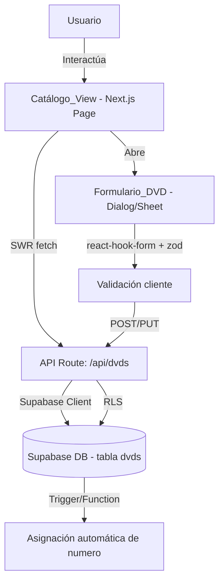

# Documento de Diseño: Catálogo de DVDs con Número de Película

## Visión General

Esta funcionalidad añade un campo `numero` (número de película) a la tabla `dvds` existente en Supabase. El número es un identificador entero positivo, único por usuario, que permite organizar físicamente la colección con etiquetas numeradas. El catálogo se ordena por este número por defecto y el usuario puede editarlo libremente.

El diseño se integra en el stack existente: Next.js 16 (App Router), Supabase, Tailwind CSS, shadcn/ui, react-hook-form + zod, y SWR para fetching.

---

## Arquitectura



**Flujo principal:**
1. El usuario accede al catálogo → SWR carga los DVDs ordenados por `numero` ASC
2. Al crear/editar un DVD → el formulario muestra el campo `numero` con sugerencia automática
3. Al guardar → la API valida unicidad y persiste en Supabase
4. El catálogo se revalida con SWR y muestra el orden actualizado

---

## Componentes e Interfaces

### 1. Migración de Base de Datos

Archivo: `supabase/migrations/YYYYMMDDHHMMSS_add_numero_to_dvds.sql`

Agrega la columna `numero` a la tabla `dvds` y crea la función/trigger para asignación automática.

### 2. API Routes

**`GET /api/dvds`** — ya existente, se extiende para:
- Ordenar por `numero ASC` por defecto
- Incluir `numero` en los campos retornados
- Aceptar parámetro `search` que también filtre por `numero`

**`POST /api/dvds`** — ya existente, se extiende para:
- Aceptar campo `numero` opcional
- Si no se provee, calcular `MAX(numero) + 1` para el usuario
- Validar unicidad de `numero` por usuario antes de insertar

**`PUT /api/dvds/[id]`** — ya existente, se extiende para:
- Aceptar campo `numero` en el body
- Validar unicidad de `numero` por usuario (excluyendo el propio registro)

### 3. Componente `DvdCard`

Muestra el número de película de forma prominente (badge o etiqueta en la esquina superior izquierda de la tarjeta).

```typescript
interface DvdCardProps {
  dvd: Dvd; // incluye campo numero: number
}
```

### 4. Componente `DvdForm`

Formulario de creación/edición. Se añade el campo `numero`:

```typescript
interface DvdFormValues {
  numero: number;        // nuevo campo
  titulo: string;
  titulo_original?: string;
  año: number;
  director?: string;
  genero?: string;
  duracion?: number;
  sinopsis?: string;
  poster_url?: string;
  tmdb_id?: string;
  ubicacion?: string;
  formato: 'DVD' | 'Blu-ray' | '4K';
  estado: 'disponible' | 'prestado';
  notas?: string;
  calificacion?: number;
}
```

El campo `numero` se pre-rellena con el siguiente número disponible al abrir el formulario de creación.

### 5. Hook `useNextNumero`

Hook personalizado que consulta el siguiente número disponible para el usuario autenticado:

```typescript
function useNextNumero(): { nextNumero: number | null; isLoading: boolean }
```

Llama a `GET /api/dvds/next-numero` que ejecuta `SELECT MAX(numero) + 1 FROM dvds WHERE user_id = $1`.

### 6. Esquema Zod actualizado

```typescript
const dvdSchema = z.object({
  numero: z.number().int().positive("El número debe ser un entero positivo"),
  titulo: z.string().min(1, "El título es obligatorio"),
  // ... resto de campos existentes
});
```

---

## Modelos de Datos

### Columna nueva en tabla `dvds`

```sql
ALTER TABLE dvds
ADD COLUMN numero INTEGER;
```

La columna es nullable inicialmente para permitir la migración de datos existentes. Después de asignar números a los registros existentes, se puede añadir la restricción NOT NULL.

### Restricción de unicidad

```sql
ALTER TABLE dvds
ADD CONSTRAINT dvds_numero_user_unique UNIQUE (user_id, numero);
```

Esta restricción garantiza que no haya dos DVDs del mismo usuario con el mismo número. La unicidad es por `(user_id, numero)`, no global.

### Función de asignación automática

```sql
CREATE OR REPLACE FUNCTION get_next_dvd_numero(p_user_id UUID)
RETURNS INTEGER AS $$
  SELECT COALESCE(MAX(numero), 0) + 1
  FROM dvds
  WHERE user_id = p_user_id;
$$ LANGUAGE SQL STABLE;
```

### Migración de datos existentes

```sql
-- Asignar números secuenciales a DVDs existentes ordenados por fecha_agregado
WITH numbered AS (
  SELECT id,
         ROW_NUMBER() OVER (PARTITION BY user_id ORDER BY fecha_agregado ASC) AS rn
  FROM dvds
  WHERE numero IS NULL
)
UPDATE dvds
SET numero = numbered.rn
FROM numbered
WHERE dvds.id = numbered.id;

-- Después de migrar, hacer la columna NOT NULL
ALTER TABLE dvds ALTER COLUMN numero SET NOT NULL;
```

### Tipo TypeScript actualizado

```typescript
interface Dvd {
  id: string;
  user_id: string;
  numero: number;          // nuevo campo
  titulo: string;
  titulo_original?: string;
  año: number;
  director?: string;
  genero?: string;
  duracion?: number;
  sinopsis?: string;
  poster_url?: string;
  tmdb_id?: string;
  ubicacion?: string;
  formato: 'DVD' | 'Blu-ray' | '4K';
  estado: 'disponible' | 'prestado';
  notas?: string;
  calificacion?: number;
  fecha_agregado: string;
}
```

### Formato de visualización del número

Para colecciones de hasta 999 ítems, el número se muestra con padding de 3 dígitos:

```typescript
function formatNumero(numero: number, total: number): string {
  const digits = total > 99 ? 3 : total > 9 ? 2 : 1;
  return String(numero).padStart(digits, '0');
}
```

---

## Propiedades de Corrección

*Una propiedad es una característica o comportamiento que debe mantenerse verdadero en todas las ejecuciones válidas del sistema — esencialmente, una declaración formal sobre lo que el sistema debe hacer. Las propiedades sirven como puente entre las especificaciones legibles por humanos y las garantías de corrección verificables por máquina.*

### Propiedad 1: Unicidad del número por usuario

*Para cualquier* colección de DVDs de un usuario, no deben existir dos DVDs con el mismo valor de `numero`.

**Valida: Requisito 1.3, 3.4, 4.4**

### Propiedad 2: Asignación automática es mayor que el máximo existente

*Para cualquier* colección de DVDs de un usuario, el número asignado automáticamente a un nuevo DVD debe ser estrictamente mayor que el número máximo existente en esa colección.

**Valida: Requisito 1.2, 4.1**

### Propiedad 3: Validación rechaza números no positivos

*Para cualquier* valor de `numero` que sea cero, negativo o no entero, el Validator debe rechazar el formulario y no persistir el registro.

**Valida: Requisito 3.3, 4.3**

### Propiedad 4: Orden numérico correcto en el catálogo

*Para cualquier* colección de DVDs, cuando se ordena por `numero`, el resultado debe estar en orden numérico estrictamente ascendente (no lexicográfico).

**Valida: Requisito 2.2, 5.2**

### Propiedad 5: Eliminación no afecta números de otros DVDs

*Para cualquier* colección de DVDs, después de eliminar un DVD con número N, los números de todos los demás DVDs de la colección deben permanecer inalterados.

**Valida: Requisito 6.1**

### Propiedad 6: Búsqueda por número devuelve coincidencias exactas

*Para cualquier* número N buscado en el catálogo, todos los DVDs retornados deben tener `numero` igual a N, y ningún DVD con `numero` distinto a N debe aparecer en los resultados cuando se busca exactamente N.

**Valida: Requisito 5.1**

---

## Manejo de Errores

| Escenario | Respuesta del sistema |
|---|---|
| Número duplicado en la misma colección | Error 409 desde la API; mensaje en el formulario: "Este número ya está en uso en tu colección" |
| Número no positivo o no entero | Validación Zod en cliente antes de enviar; mensaje: "El número debe ser un entero positivo" |
| Fallo al obtener el siguiente número disponible | El campo `numero` se muestra vacío; el usuario debe ingresarlo manualmente |
| Violación de constraint UNIQUE en Supabase | La API captura el error de Postgres (código 23505) y retorna 409 con mensaje descriptivo |
| Migración de datos existentes con números nulos | La función de migración asigna números secuenciales por `fecha_agregado` |

---

## Estrategia de Testing

### Tests Unitarios

- Validación del esquema Zod: números válidos, cero, negativos, decimales, strings
- Función `formatNumero`: colecciones de 1, 10, 100, 1000 ítems
- Función `get_next_dvd_numero`: colección vacía (retorna 1), colección con gaps (retorna max+1)
- Manejo del error 409 en el formulario

### Tests de Propiedades (Property-Based Testing)

Se usará **fast-check** (TypeScript) como librería de property-based testing. Cada test debe ejecutar mínimo 100 iteraciones.

**Configuración de tags:**
Cada test de propiedad debe incluir un comentario con el formato:
`// Feature: dvd-catalog, Property N: <texto de la propiedad>`

**Property 1 — Unicidad del número por usuario**
Generar una colección aleatoria de DVDs con números únicos, intentar insertar un DVD con un número ya existente, verificar que la operación es rechazada.
`// Feature: dvd-catalog, Property 1: Unicidad del número por usuario`

**Property 2 — Asignación automática es mayor que el máximo**
Generar una colección aleatoria de DVDs con números positivos, llamar a `get_next_dvd_numero`, verificar que el resultado es `MAX(numeros) + 1`.
`// Feature: dvd-catalog, Property 2: Asignación automática es mayor que el máximo existente`

**Property 3 — Validación rechaza números no positivos**
Generar valores aleatorios que no sean enteros positivos (cero, negativos, decimales, strings), verificar que el esquema Zod los rechaza todos.
`// Feature: dvd-catalog, Property 3: Validación rechaza números no positivos`

**Property 4 — Orden numérico correcto**
Generar una lista aleatoria de DVDs con números positivos únicos, ordenarlos con la función de ordenación del catálogo, verificar que el resultado está en orden estrictamente ascendente.
`// Feature: dvd-catalog, Property 4: Orden numérico correcto en el catálogo`

**Property 5 — Eliminación no afecta otros números**
Generar una colección aleatoria, eliminar un DVD aleatorio, verificar que los números de los DVDs restantes son idénticos a los que tenían antes de la eliminación.
`// Feature: dvd-catalog, Property 5: Eliminación no afecta números de otros DVDs`

**Property 6 — Búsqueda por número devuelve coincidencias exactas**
Generar una colección aleatoria de DVDs con números únicos, buscar por un número N aleatorio de la colección, verificar que todos los resultados tienen `numero === N`.
`// Feature: dvd-catalog, Property 6: Búsqueda por número devuelve coincidencias exactas`
